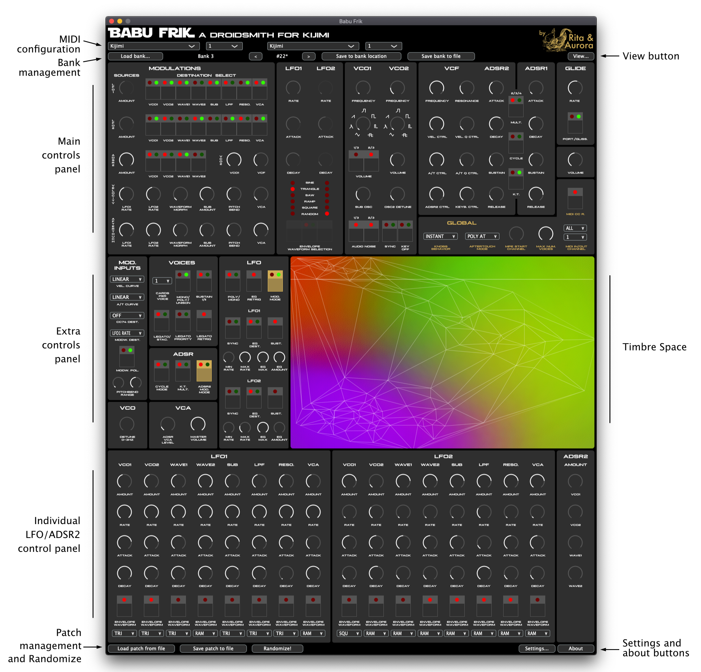
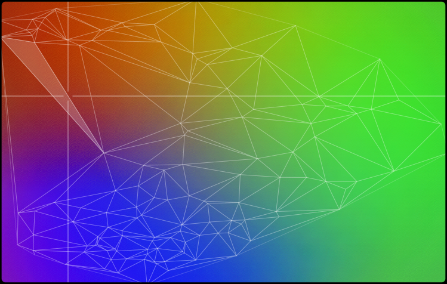
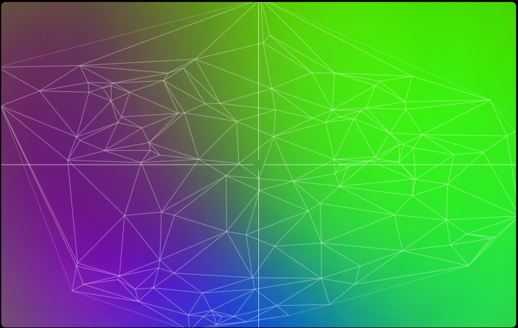
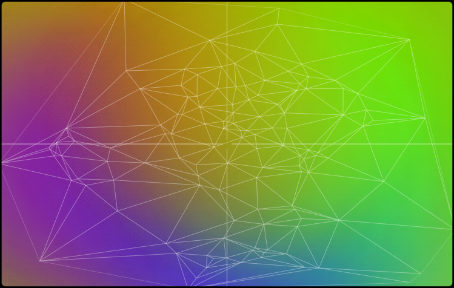
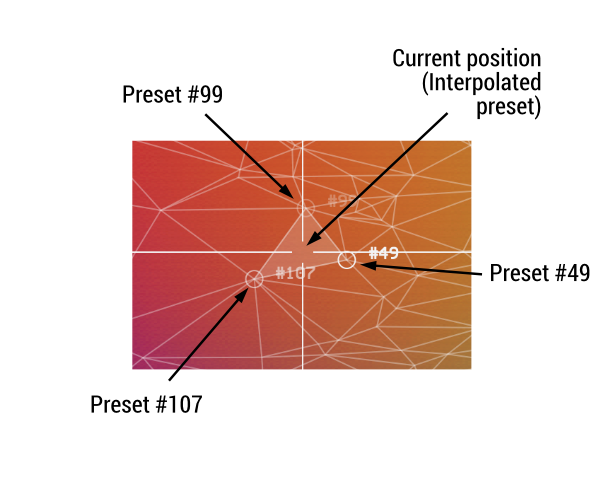
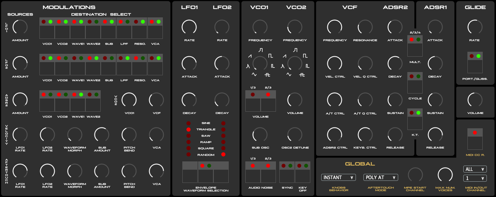
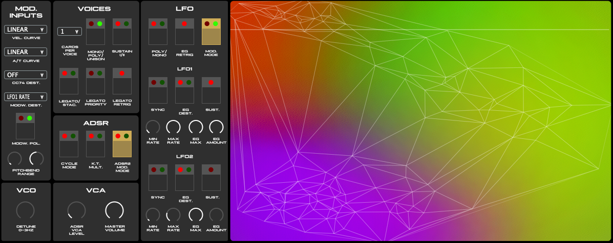
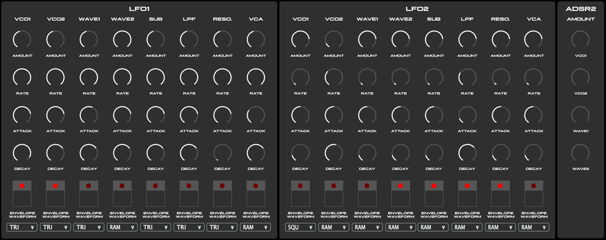
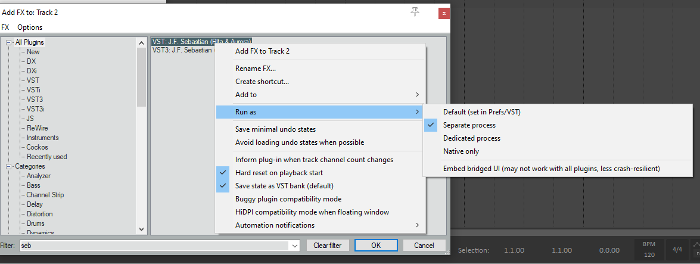

# Babu Frik - User Manual

  * [Overview](#overview)
  * [1. Installation](#1-installation)
     * [1.1 Compatibility notes](#11-compatibility-notes)
     * [1.2 Release notes](#12-release-notes)
  * [2. Using Babu Frik](#2-using-babu-frik)
     * [2.1 Loading Babu Frik as an audio plugin](#21-loading-babu-frik-as-an-audio-plugin)
     * [2.2 MIDI configuration](#22-midi-configuration)
        * [2.2.1 MIDI input](#221-midi-input)
        * [2.2.2 MIDI output](#222-midi-output)
        * [2.2.3 Automatic scanning of MIDI devices](#223-automatic-scanning-of-midi-devices)
        * [2.2.4 Synchronisation of KIJIMI state with Babu Frik state](#224-synchronisation-of-kijimi-state-with-babu-frik-state)
     * [2.3 Bank and patch management](#23-bank-and-patch-management)
        * [2.3.1 Loading a bank](#231-loading-a-bank)
        * [2.3.2 Saving the current patch to a specific bank location](#232-saving-the-current-patch-to-a-specific-bank-location)
        * [2.3.3 Saving a bank](#233-saving-a-bank)
        * [2.3.4 Loading and saving patch files](#234-loading-and-saving-patch-files)
     * [2.4 The Timbre Space](#24-the-timbre-space)
     * [2.5 KIJIMI control panels](#25-kijimi-control-panels)
     * [2.6 The Randomizer](#26-the-randomizer)
     * [2.7 UI size](#27-ui-size)
  * [3. Known bugs and limitations](#3-known-bugs-and-limitations)
  * [4. Licensing](#4-licensing)
  * [5. Credits and acknowledgements](#5-credits-and-acknowledgements)
  * [6. Support Babu Frik development](#6-support-babu-frik-development)

## Overview

Named after a famous *droidsmith* who's said to be able to reprogram any droid and even make them speak Sith, Babu Frik is a software app that allows you to control and explore the sonic possibilities of the KIJIMI synthesiser by Black Corporation. It works both as a **stand-alone** app and as an **audio plug-in** with automatable parameters.

With Babu Frik you can import KIJIMI banks (from files or from KIJIMI itself), edit patches and export them. When you import a bank, a Timbre Space will be created which will allow you to navigate all the patches in a colourful space and create new ones. Just click anywhere on the Timbre Space and play the synth. Click on another point to get a new patch. Close points in the space will result in similar sounding patches.

Babu Frik includes all the controls you'll find the main panel of KIJIMI, but also includes extra panels which will allow you to control all the extra KIJIMI menu-hidden options, including the 16 individual LFOs.

Here is a screenshot of Babu Frik with the different parts of the interface highlighted. The sections below describe each one of them.

## 1. Installation

Installation of Babu Frik should be straight-forward as we provide installer packages which should place all the files in the corresponding locations. Here are the steps to follow:

 1. Go to the [Babu Frik download page](https://github.com/RitaAndAurora/kijimi-babu-frik/releases) and get the **macOS** or **windows** installer (depending on your platform).
 2. Run the installer and click `next`/`continue` buttons until installation finishes. We recommend you to use the default installation options. The installer will copy files in the following locations:

 *macOS*
 
  * Stand-alone app: `/Applications/`
  * VST3: `/Library/Audio/Plug-Ins/VST3/`
  * AU: `/Library/Audio/Plug-Ins/Components/`

 *windows*
 
  * Stand-alone app: `c:\Program Files (x86)\BabuFrik\`
  * VST2: `c:\Program Files (x86)\Common Files\VST2\`
  * VST3: `c:\Program Files (x86)\Common Files\VST3\`

 3. Run the stand-aloone app from the directory it has been installed or either open your favorite DAW. Babu Frik should appear in the list of available plugins. If that is not the case you might need to trigger a *re-scanning* of the plugins folder by the DAW. If after doing that Babu Frik still does not appear, make sure your DAW is looking for plugins in the default locations listed above.

### 1.1 Compatibility notes

 * Babu Frik should be compatibale with all major DAWs supporting either Audio Units (**AU**) or **VST3** plugins. 
 * Note that Babu Frik is **64-bit** so it might not work with old versions of DAWs. 
 * We did not compile an **AAX** version of the plugin because AAX requires a lot of bureaucracy on our side to get the plugin signed and hopfully the other formats will cover most setups.
 * We have successfully tested Babu Frik  in the setups listed below. Other setups should work as well but we have not tested them.
   * macOS (10.15) / Stand-alone
   * macOS (10.15) / Bitwig Studio 2/3
   * macOS (10.15) / Logic Pro X
   * macOS (10.15) / Live 10
   * windows 10 / Stand-alone
   * windows 10 / Bitwig Studio 3

### 1.2 Release notes

**Version 1.0**

 * Initial release of Babu Frik with all features promised in the Kickstarter campaign description and more!
 * Full control of KIJIMI prameters, including those hidden in the KIJIMI menu.
 * Timbre Space that allows you to create new patches by inteligently merging existing patches in a bank.
 * Bank file saving/loading, patch file saving/loading, and functionality to dumping/import banks to/from KIJIMI.
 * Runs as stand-alone app or as a VST37AU plugin in macOS or Windoes.
 * Automatable parameters when Babu Firk is running as a plugin in a DAW.
 * Patch randomizer
 * UI scaling and scrolling

## 2. Using Babu Frik

### 2.1 Loading Babu Frik as an audio plugin

Babu Frik can run as a **stand-alone application** or as an **audio plugin** inside your DAW. When running as an audio plugin it works as an **audio effect** but effectively acts as a *bypass effect* for all the audio received in the input (i.e. it passes the input audio to the output and leaves it unaffected). The typical setup is to create a *MIDI/external instrument* track in your DAW which routes MIDI to the KIJIMI and receives the audio signal from KIJIMI. In that track Babu Frik can be placed as an effect.

The main advantage of loading Babu Frik as a plugin instead of using it stand-alone is that it allows the DAW to control KIJIMI's parameters, enabling **parameter automation** and any other sort of **modulation capabilities** offered by the DAW.

### 2.2 MIDI configuration

Babu Frik communicates with KIJIMI over MIDI. When loaded as an audio plugin it acts as an intermediary between the DAW and KIJIMI, exposing KIJIMI controls as audio parameters of the plugin and then modifying them accordingly using MIDI *control change* and *sysex* messages.

The MIDI configuration section includes dropdowns for configuring the MIDI **input/output devices** as well the **MIDI channels** to communicate with KIJIMI. Note that when loaded as a plugin, Babu Frik's MIDI configuration is **completely independent from the DAW MIDI configuration** of the channel where Babu Frik is loaded. Therefore it bypasses the MIDI in/out of the channel and only sends/receives from its own devices and channels.

**IMPORTANT NOTE**: make sure that your MIDI setup does not filter MIDI sysex messages sent around, otherwise Babu Frik won't be able toc communicate properly with KIJIMI. The safest way to ensure that is to use Babu Frik using KIJIMI's MIDI USB port.

#### 2.2.1 MIDI input

MIDI input is used to receive MIDI data from KIJIMI which allows to sync the state of Babu Frik with the real state of KIJIMI (e.g. when a knob or button is turned/pressed in KIJIMI, or when a patch is loaded). **MIDI input configuration is optional** as Babu Frik can operate without it, but Babu Frik will be working in sub-optimal conditions if MIDI input is not properly configured..

To configure MIDI input please select the device from the dropdown menu to which KIJIMI is sending messages. If your KIJIMI is connected over USB, you should see a device named "**Kijimi**". You also need to select the MIDI channel where KIJIMI sends the *control change* messages to. Note that KIJIMI also sends MIDI *sysex* messages and these do not have a specific MIDI channel therefore should work regardless of the MIDI input channel configuration.

#### 2.2.2 MIDI output

MIDI output is used to send MIDI data to the KIJIMI and control it *remotely*. **MIDI output configuration is mandatory** as otherwise Babu Frik has no way to communicate with KIJIMI.

To configure MIDI output please select the device from the dropdown menu that will send messages to KIJIMI. If your KIJIMI is connected over USB, you should see a device named "**Kijimi**". You also need to select the MIDI channel where KIJIMI is listening for *control change* messages. Note that Babu Frik  also sends MIDI *sysex* messages and these do not have a specific MIDI channel therefore should work regardless of the channel MIDI output channel configuration.

Note also that for Babu Frik to work optimally, **KIJIMI needs to have "CC receive" option enabled**. You'll find that option in the MIDI settings menu of KIJIMI and also in the extra controls panel of Babu Frik.

**IMPORTANT NOTE**: Babu Frik only sends MIDI *control change* messages to the KIJIMI and does not handle any other kind of MIDI data. To send *note on/off* messages form your keyboard to the KIJIMI, you need to configure the routing independently of Babu Frik (e.g. using your DAW, using some other MIDI routing application, or sending notes via the KIJIMI MIDI DIN5 connector).

#### 2.2.3 Automatic scanning of MIDI devices

Babu Frik can continuously check if new MIDI devices are connected or disconnected from your computer to updated the options of the lists of available devices for MIDI input and output. This allows to connect MIDI devices while Babu Frik is already runnning and have them avialalbe in the menus. However, this feature is **disabled by default**.

To enable or disable automatic scanning of midi devices click on the `Settings...` button on the lower right corner of Babu Frik, and choose the `MIDI device scan` option. An option named `Auto-scan MIDI devices` will appear ticked (&#10003;) if automatic scanning is enabled. Click on that option to toggle it. Additionally, only when `Auto-scan MIDI devices` is disabled, an extra option named `Scan devices now` will appear enabled. Click on that to trigger a *one-time* update of the currently available MIDI devices.

#### 2.2.4 Synchronisation of KIJIMI state with Babu Frik state

If MIDI input/output devices and channels are configured properly and KIJIMI has the "CC Receive" option enabled, Babu Frik and KIJIMI should be always sycnrhonized. This means that **the values of the knobs, buttons and other options shown in the Babu Frik panels, should corresponds to the internal values of these knobs, buttons and other controls in KIJIMI**. If a new patch is loaded from Babu Frik (or a new patch is created using the Timbre Space or Randomizer), KIJIMI will immediately set all of its controls to the values of the patch. Simialrly, if a patch is loaded in KIJIMI (or panel mode is activated, or the KIJIMI randomizer is used, etc.), Babu Firk will be immediatley updated reflecting the new state of all KIJIMI controls.

This automatic syncing behaviour can be disabled by clicking on the `Settings...` button on the lower right corner of Babu Frik and unticking the `Auto-sync with KIJIMI state` option that will be shown in the `KIJIMI state` menu. This option is **enabled by default**.

If auto-sync is turned off or for some reason Babu Frik and KIJIMI fail to synchronise the state, you can trigger the synchronisation manually using the `Send current state to KIJIMI` and `Load current state from KIJIMI` options from the `KIJIMI state` menu that appears when clicking in the `Settings...` button on the lower right corner of Babu Frik.

### 2.3 Bank and patch management

**Babu Frik has an internal bank of patches** which works independently of the banks and patches loaded in KIJIMI. However, Babu Frik provides several ways to load KIJIMI banks/patches into the internal bank, to send these patches and banks *back* to KIJIMI, and to save and load banks and patches to and from bank and patch files (with *.syx* and *.kpatch* extensions, respectively). All these features in combination allow for proper bank and patch management.

It is important **not to confuse the internal Babu Frik bank with the banks of KIJIMI**. Babu Frik won't automatically load the currently selected bank in KIJIMI, nor it will automatically send its internal bank to KIJIMI (if not told to do so). In fact, a very common scenario is that Babu Frik's internal bank is different than the currently selected bank in KIJIMI. In that case, chosing a specific patch in Babu Frik (e.g. pacth number 8), will load a patch which will sound different than selecting that same patch number using the KIJIMI encoder. On the contrary, if Babu Frik has loaded the current KIJIMI bank into its internal bank (see how to do that below), then patch numbers should correspond to the same sounds. Note that in either case **the patch number shown in the KIJIMI screen is not supposed to be updated when patches are loaded through Babu Frik** because Babu Frik sends KIJIMI the values for all the controls that need to be set, but does not tell KIJIMI to load a particular patch form its stored banks.

#### 2.3.1 Loading a bank

You can load a bank to the internal Babu Frik bank of patches either by loading a bank file (file extension *.syx*) or by importing one of KIJIMI's banks. Pressing the `Load bank...` button in the upper left corner of Babu Frik will reveal the two options.

Bank contain up to 128 patches. Once loaded, you can use the left and right arrow buttons to navigate among the existing patches. You can also type the patch number you want to go to by clicking on the patch number. By default, Babu Frik's internal bank is loaded with the official **MJ** bank provided by Black Corporation.

When a bank is loaded, a new Timbre Space is built based on all the patches contained in the bank (more info in [Section 2.4](#24-the-timbre-space)).

When navigating the different patches of a bank, you'll see how both the controls on the screen and the sound of the KIJIMI change according to the selected patch (also you should see the leds in KIJIMI updating accordingly). You'll also see how the selected point in the Timbre Space moves at each patch change. This indicates the point in the Timbre Space that corresponds to the selected patch (more info in [Section 2.4](#24-the-timbre-space)).

Finally, note that if any parameter changes its value after loading a specific patch, the symbol * appears next to the patch number to indicate that the controls are no longer *in sync* with the stored values of that patch.

#### 2.3.2 Saving the current patch to a specific bank location

Use the `Save to bank location...` button to save the current patch (the control values shown in Babu Frik) to another location of the internal Babu Frik bank. When pressing the button a dialog will appear asking you to introduce the bank location to which the patch should be saved. This operation will overwrite any existing patch information in that location.

#### 2.3.3 Saving a bank

Babu Frik can export it's internal bank to either a bank file (with extension *.syx*) or to the currently selected bank in KIJIMI. Pressing the `Save bank...` button will reveal the two options.

The bank files generated by Babu Frik are fully compatible with standard KIJIMI bank files. You can even later dump these files to KIJMI using external software like *sysex librarian* (although you don't really need to do that because you can also dump the file to KIJIMI from Babu Frik itself).

#### 2.3.4 Loading and saving patch files

Besides managing patches at the bank level, Babu Frik also allows you to save and load patches indidvidually using patch files with extension *.kpatch*. You can do that using the `Load patch form file` and `Save patch to file` buttons in the lower left corner of Babu Frik. This allows you to store your patches in individual files and give meaningfull filenames to them. It also facilitates sharing individual patces with the community.

### 2.4 The Timbre Space

The Timbre Space is an innovative feature of Babu Frik that allows to **explore the sonic possibilities of KIJIMI in completely new ways**. Every time a bank is loaded, Babu Frik creates a new Timbre Space which projects all the presents of that bank file into a *colorful* 2-dimensional space. **Simply click anywhere in the Timbre Space to generate new patches for KIJIMI**. Here you can see a [video of the Timbre Space in action](https://youtu.be/cHdO393UwKI?t=44) (**NOTE**: this video is for J.F. Sebastian editor for Deckard's Dream, but it works in the same way).

The Timbre Space uses **machine learning** to analyze the distribution of parameters values in a given bank file and to create a 2-dimensional representation of it in which patches are organized according to *some notion of similarity*. Here are some examples of spaces created using different KIJIMI bank files:

The Timbre Space contains a triangle mesh in which each triangle edge corresponds to the position of one of the bank's patches after its projection into the 2-dimensional space. Clicking on any point in the space will create a new patch based on the 3 patches of the enclosing triangle. **Close points in the Timbre Space are expected to produce similar sounding patches**.

When selecting a point in the space, the patch numbers on which the new patch is based are displayed on screen (see picture above). After a specific point in the Timbre Space is loaded, if any of the KIJIMI controls is modified, the patch numbers on the Timbre Space will disappear to indicate that the controls are no longer *in sync* with the values of the selected Timbre Space position.

The selected position in the Timbre Space is also exposed by Babu Frik as two **audio parameters** named **Space X** and **Space Y**. These parameters can also be automated. 

### 2.5 KIJIMI control panels

Babu Frik has a *virtual* representation of all KIJIMI's hardware controls and also of the internal options hidden in KIJIMI's menus. These controls are divided in three panels:

1) The **main panel** which includes the controls of the KIJIMI's main manel and the **global** KIJIMI settings (which are not stored/loaded in patch info).

2) The **extra panel** which includes the controls for the KIJIMI options hidden in the menus and also the **Timbre Space**.

3) The **individual LFOs/ADSR2 panel** which includes the controls of the 16 individual LFOs and ADSR2 amounts of the individual modulation modes for LFOs and ADSR2.

Using the `View...` button on the upper right side of Babu Frik you can show or hide any of these 3 panels individually.

If MIDI output is properly configured, moving the controls in Babu Frik will set the corresponding controls in the KIJIMI hardware unit (even if the auto-sync state option discussed above is not enabled). Similarly, if MIDI input is properly configured, setting the controls in the hardware unit will cause the controls in Babu Frik interface to update. Double-clicking the knobs will set them to the center position.

All knobs and buttons are exposed as **audio parameters** to the DAW, meaning that their movement can be **recorded**, **automated** and **modulated** if the DAW has such capabilities. Here is a [video example of parameter modulation and automation](https://youtu.be/cHdO393UwKI?t=170) usig [Bitwig Studio](https://www.bitwig.com) as a DAW (**NOTE**: this video is for J.F. Sebastian editor for Deckard's Dream, but everything shown here can also be done with Babu Frik). **Warning**: it is possible to record/automate the position in the timbre space using the parameters `Space X` and `Space Y` (see [Section 2.4](#24-the-timbre-space)). When doing that take into account that these will make all other audio parameters to change therefore it is not advised to record/automate timbre space position plus other parameters at the same time.

**IMPORTANT NOTE**: The controls in the  individual LFOs/ADSR2 panel will appear disabled unless the *individual modualtion mode* is selected for wither LFOs or ADSR2. The buttons to toggle these modes are conveniently marked in yellow in the extra controls panel (see picture above). When in individual mode, some controls in the main panel are supposed to be replaced by the controls in the LFOs/ADSR2 panel and therefore these will appear disabled. Yeah, I know, this gets messy. If you have doubts about the individual LFOs/ADSR2 mode ask Black Corporation guys :)

### 2.6 The Randomizer

Babu Frik incorporates a feature to create slight (or wild!) variations of the currently loaded patch. This is called the **Randomizer**. Clicking on the `Randomize!` button in the lower part of the interface will instantly create a variation of the current patch. Using the `Settings...` button on the lower right side of Babu Frik and chosing the `Randomizer settings` menu you can set some options to decide how the Randomizer will change the patch:

* `Affected controls`: using that menu option you can select which controls will be affected by the Randomizer when pressing the `Randomize!` button. You can enable or disable the controls of each of the 3 panels individually (main panel, extra panel and LFOs/ADSR2 panel).

* `Amount`: using that menu you can choose how much will each parameter be randomized when pressing the `Randomize!` button. Range goes from 5% (small variation with respect to the current parameter value) to 100% (completely new random value). 

Randomizer settings are stored with Babu Frik's internal state and will be remembered between Babu Frik runs.

### 2.7 UI size

Babu Frik incorporates an option to adjust the size of the UI to match smaller screens. You can adjust the size clicking in the `View...` button in the upper right corner of Babu Frik and selecting the `Zoom` sub-menu. Available options are 70%, 80%, 90% and 100% of the original size. The zoom preference is stored together with other Babu Frik properties so the preference is remembered in different runs of the app both running as stand-alone or as a plugin.

Furthermore, Babu Frik can scroll the UI horizontally or vertically if it does fit all on the screen. If that is the case, scrollbar(s) will appear. You can choose to hide scrollbars (but still be able to scroll using the mouse) by ticking the `Hide scrollbars` option in the `View...` menu.

## 3. Known bugs and limitations

What follows is a list of known Babu Firk bugs and limitations of the software. Please, for **bug reports** and **feature requests** visit [https://github.com/RitaAndAurora/kijimi-babu-frik/issues](https://github.com/RitaAndAurora/kijimi-babu-frik/issues).

  * Communication with KIJIMI is **limited to the speed at which MIDI messages can be transmitted**. Automation and modulation of parameters is therefore subject to that. We did some testing and the message throughput seems to be quite good, specially using MIDI over USB, but still that could be a limitation for very fast modulations.

 * When using Babu Frik in stand-alone mode, it could happen that a **warning is displayed about potential audio feedback loops**. This can be fixed by clicking on the `Settings...` button that will appear next to the warning and unticking the *Mute audio input* checkbox. Babu Frik will remember this choice so the warning is not displayed again. This is a bug that will be addressed in future updates of Babu Frik as Babu Frik uses no audio and the warning should never appear.

 * In setups including multiple monitors with different resultions, some being standard resolution monitor (e.g. FullHD) and others being high dpi monitors (e.g. 4k), it can happen that **Babu Frik is scaled incorrectly in one of the two monitors**. There is no definitive solution for that so far, but I would recommend trying to open Babu Frik in one monitor or in the other and see if that makes any difference. In any case you'll be able to use the scale and scrolling facilities of Babu Frik to reach all controls.

 * Some users reported **issues using J.F. Sebastian as a plugin in Reaper and under Windows**. Babu Frik works in a very similar way to J.F. Sebastian, therefore I expect these issues to happen as well. This is because MIDI devices are "locked" by the Reaper process and J.F. Sebastian/Babu Frik can't talk directly to DDRM/KIJIMI. This can be fixed by configuring J.F. Sebastian/Babu Frik to `Run as > Separate process` as in the screenshot below. Many thanks to David Berndsen for the tip (and the screenshot)!

## 4. Licensing

Babu Frik is released under the **GPLv3** open source software license (see [LICENSE](https://github.com/ritaandaurora/kijimi-babu-frik/blob/master/LICENSE) file) with the code being available at  [https://github.com/ritaandaurora/kijimi-babu-frik](https://github.com/ritaandaurora/kijimi-babu-frik). Babu Frik uses the following open source software libraries: 

 * [tapkee](http://tapkee.lisitsyn.me), available under BSD 3-clause license 
 * [delaunator-cpp](https://github.com/delfrrr/delaunator-cpp), available underMIT license
 * [juce](https://juce.com), available under GPLv3 license 

## 5. Credits and acknowledgements

Babu Frik has been ideated and developed by [Rita & Aurora](https://ritaandaurora.github.io), a sort of fancy branding name I've given to my audio-developer [self](https://ffont.github.io). Nevertheless, Babu Frik would have not been possible without the generous contributions of [**BLACK CORPORATION**](http://black-corporation.com) and the **KICKSTARTER BACKERS**. Infinite thanks to all of you:

#### Absolutely awesome backers
 - FREQNOIR
 - MONTY BRANDENBERG
 - ROB BEKHUIS
 - RODRIGUE DUCOURANT
 - RON DEACON
 - STEPHEN DRAKE

#### Gold backers
- Anasia
- Antonio Martinez
- Derek Matthew Duke
- Eric Harder
- Jeremy Curtis
- Kevin T. Looney
- Neil Huxley
- Robert Kukuchka
- Rupert Williams
- STEGA
- triangle
- Unkar Plutt

#### Silver backers
- Christer Janson
- Claudiu D.
- Cléo
- Jake Boswell
- Jon Daou
- Kevin Meyer
- Reggie Barnes

#### Bronze backers
- Alex Taam
- Dan Formless (Forward Movement)
- David Forman
- Janne Isotalo
- Morgan Ross
- Pyramid
- René M Thalund

## 6. Support Babu Frik development

If you want to support the development of Babu Frik and similar tools you can consider [making a donation](https://ritaandaurora.github.io/kijimi-babu-frik/donate). That will make me very happy :)

 
 

