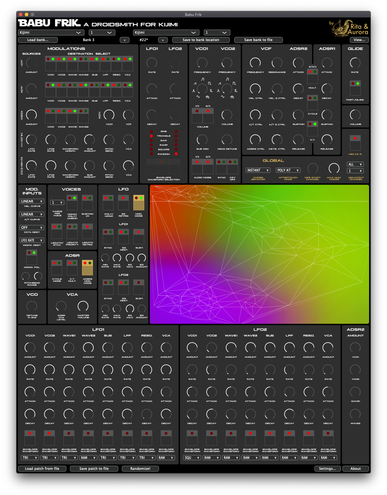

# Babu Frik, a droidsmith for KIJIMI



## Overview

Named after a famous *droidsmith* who's said to be able to reprogram any droid and even make them speak Sith, Babu Frik is a software app that allows you to control and explore the sonic possibilities of the KIJIMI synthesiser by Black Corporation. It works both as a **stand-alone** app and as an **audio plug-in** with automatable parameters.

With Babu Frik you can import KIJIMI banks (from files or from KIJIMI itself), edit patches and export them. When you import a bank, a Timbre Space will be created which will allow you to navigate all the patches in a colourful space and create new ones. Just click anywhere on the Timbre Space and play the synth. Click on another point to get a new patch. Close points in the space will result in similar sounding patches.

Babu Frik includes all the controls you'll find the main panel of KIJIMI, but also includes extra panels which will allow you to control all the extra KIJIMI menu-hidden options, including the 16 individual LFOs.

Checkout [Babu Frik](https://ritaandaurora.github.io/kijimi-babu-frik/)'s website for more information.

Babu Firk is a reality thanks to the Kickstarter backers and the help and contributions by Black Corportation. Check out the [Kickstarter campaign page](https://www.kickstarter.com/projects/454739355/babu-frik-make-your-kijimi-sing-in-sith) for more information about the campagin.


## Download

You'll find download links in the [Babu Frik website](https://ritaandaurora.github.io/kijimi-babu-frik/) and also in the [Releases](https://github.com/RitaAndAurora/kijimi-babu-frik/releases) section of this code repository. Don't hesitate to report bugs or make suggestions using the tools in the [issues section](https://github.com/ritaandaurora/kijimi-babu-frik/issues).


## Help

Please check the user manual for an explanation of the different features of [Babu Frik](https://github.com/RitaAndAurora/kijimi-babu-frik/blob/master/MANUAL.md) and how to use it.


## Build instructions (for developers)

Babu Frik is implemented as a JUCE audio plug-in/standalone app and can be edited and built using standard JUCE workflows. To build Baby Frik you need to

1) checktout the code repository including submodules;

```
git clone https://github.com/RitaAndAurora/kijimi-babu-frik.git && cd kijimi-babu-frik.git && git submodule update --init
```

2) open the project files  for *XCode* (macOS) and *Visual Studio 2019* (windows) you'll find in the `Builds/` folder and compile the projects there.

For advanced development options you'll need to open the `BabuFrik.jucer` using JUCE's Projucer, but this is not needed for basic edits and/or building Babu Frik. Note that if you go that way you'll need a Projucer version which is compatible with Babu Frik. The best way to go is to compile Projucer from the JUCE submodule in the code repository (i.e. use project files in `3rdParty/JUCE/extras/Projucer/Builds/`). 


## License

Babu Frik is released under the **GPLv3** open source software license (see [LICENSE](https://github.com/ritaandaurora/kijimi-babu-frik/blob/master/LICENSE) file) with the code being available at  [https://github.com/ritaandaurora/kijimi-babu-frik](https://github.com/ritaandaurora/kijimi-babu-frik). Babu Frik uses the following open source software libraries: 

 * [tapkee](http://tapkee.lisitsyn.me), available under BSD 3-clause license 
 * [delaunator-cpp](https://github.com/delfrrr/delaunator-cpp), available underMIT license
 * [juce](https://juce.com), available under GPLv3 license 
 


## Credits and acknowledgements

Babu Frik has been ideated and developed by [Rita & Aurora](https://ritaandaurora.github.io), a sort of fancy branding name I've given to my audio-developer [self](https://ffont.github.io). Nevertheless, Babu Frik would have not been possible without the generous contributions of [**BLACK CORPORATION**](http://black-corporation.com) and the **KICKSTARTER BACKERS**. Infinite thanks to all of you:

#### Absolutely awesome backers
 - FREQNOIR
 - MONTY BRANDENBERG
 - ROB BEKHUIS
 - RODRIGUE DUCOURANT
 - RON DEACON
 - STEPHEN DRAKE

#### Gold backers
- Anasia
- Antonio Martinez
- Derek Matthew Duke
- Eric Harder
- Jeremy Curtis
- Kevin T. Looney
- Neil Huxley
- Robert Kukuchka
- Rupert Williams
- STEGA
- triangle
- Unkar Plutt


#### Silver backers
- Christer Janson
- Claudiu D.
- Cléo
- Jake Boswell
- Jon Daou
- Kevin Meyer
- Reggie Barnes


#### Bronze backers
- Alex Taam
- Dan Formless (Forward Movement)
- David Forman
- Janne Isotalo
- Morgan Ross
- Pyramid
- René M Thalund


<p align="center">
<a href="https://ritaandaurora.github.io"></a>
</p>
