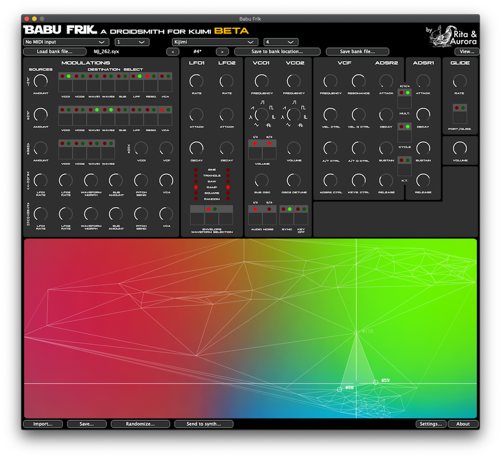

# Babu Frik, a droidsmith for KIJIMI



## Overview

WORK IN PROGRESS software editor for Black Corportation's KIJIMI. More information: [https://www.kickstarter.com/projects/454739355/babu-frik-make-your-kijimi-sing-in-sith](https://www.kickstarter.com/projects/454739355/babu-frik-make-your-kijimi-sing-in-sith) 


## Download

Babu Frik is not yet released! Nevertheless, you can already find beta releases in the [Releases](https://github.com/RitaAndAurora/kijimi-babu-frik/releases) section and test them. Don't hesitate to report bugs or make suggestions using the tools in the [issues section](https://github.com/ritaandaurora/kijimi-babu-frik/issues):

 * Go here for [Babu Frik v0.1 (beta1) download link and release notes](https://github.com/RitaAndAurora/kijimi-babu-frik/releases/tag/v0.1)

The beta releases don't include an installer, so **you'll have to install the plugins/standalone app manually**. To do that, you should copy the downloaded files in the following location(s):

*macOS*
 
  * `BabuFrik.app` (Stand-alone app): `/Applications/`
  * `BabuFrik.vst3` (VST3): `/Library/Audio/Plug-Ins/VST3/`
  * `BabuFrik.component` (AU): `/Library/Audio/Plug-Ins/Components/`

 *windows*
 
  * `BabuFrik.exe` (Stand-alone app): `c:\Program Files (x86)\JFSebastian\`
  * `BabuFrik.vst3` (VST3): `c:\Program Files (x86)\Common Files\VST3\`


**WARNING: beta releaes lack features and contain bugs, don't expect them to work perfectly. Please always read the corresponding release notes.**


## Help

Babu Frik's manual is not yet ready! However, you can use [J.F. Sebastian's manual](https://github.com/RitaAndAurora/ddrm-jfsebastian/blob/master/MANUAL.md) (the equivalent of Babu Frik, but for Deckard's Dream) as it might answer most of your questions and both apps work basically the same :)


## Build instructions (for developers)

Babu Frik is implemented as a JUCE audio plug-in/standalone app and can be edited and built using standard JUCE workflows. To build Baby Frik you need to

1) checktout the code repository including submodules;

```
git clone https://github.com/RitaAndAurora/kijimi-babu-frik.git && cd kijimi-babu-frik.git && git submodule update --init
```

2) open the project files  for *XCode* (macOS) and *Visual Studio 2019* (windows) you'll find in the `Builds/` folder and compile the projects there.

For advanced development options you'll need to open the `BabuFrik.jucer` using JUCE's Projucer, but this is not needed for basic edits and/or building Babu Frik. Note that if you go that way you'll need a Projucer version which is compatible with Babu Frik. The best way to go is to compile Projucer from the JUCE submodule in the code repository (i.e. use project files in `3rdParty/JUCE/extras/Projucer/Builds/`). 


## License

Babu Frik is released under the **GPLv3** open source software license (see [LICENSE](https://github.com/ritaandaurora/ddrm-jfsebastian/blob/master/LICENSE) file) with the code being available at  [https://github.com/ritaandaurora/kijimi-babu-frik](https://github.com/ritaandaurora/kijimi-babu-frik). Babu Frik uses the following open source software libraries: 

 * [tapkee](http://tapkee.lisitsyn.me), available under BSD 3-clause license 
 * [delaunator-cpp](https://github.com/delfrrr/delaunator-cpp), available underMIT license
 * [juce](https://juce.com), available under GPLv3 license 
 


## Credits and acknowledgements

Babu Frik has been ideated and developed by [Rita & Aurora](https://ritaandaurora.github.io), a sort of fancy branding name I've given to my audio-developer [self](https://ffont.github.io). Nevertheless, Babu Frik would have not been possible without the generous contributions of [**BLACK CORPORATION**](http://black-corporation.com) and the **KICKSTARTER BACKERS**. Infinite thanks to all of you:

#### Absolutely awesome backers
 - FREQNOIR
 - MONTY BRANDENBERG
 - ROB BEKHUIS
 - RODRIGUE DUCOURANT
 - RON DEACON
 - STEPHEN DRAKE

#### Gold backers
- Anasia
- Antonio Martinez
- Derek Matthew Duke
- Eric Harder
- Jeremy Curtis
- Kevin T. Looney
- Neil Huxley
- Robert Kukuchka
- Rupert Williams
- STEGA
- triangle
- Unkar Plutt


#### Silver backers
- Christer Janson
- Claudiu D.
- Cléo
- Jake Boswell
- Jon Daou
- Kevin Meyer
- Reggie Barnes


#### Bronze backers
- Alex Taam
- Dan Formless (Forward Movement)
- David Forman
- Janne Isotalo
- Morgan Ross
- Pyramid
- René M Thalund


<p align="center">
<a href="https://ritaandaurora.github.io"></a>
</p>
